<!--
  Entity relationship diagram for sql/safebrgy_schema.sql.
  Mermaid uses crow's-foot notation:
  ||--o{ = one-to-many, ||--o| = one-to-zero-or-one,
  }o--o{ = many-to-many through an associative table.
-->

# SafeBrgy Entity Relationship Diagram

## Relationship Diagram

```mermaid
erDiagram
	users ||--o| barangay_settings : "updates"
	users ||--o{ admin_logs : "creates"
	users ||--o{ announcements : "authors"
	users ||--o{ announcement_reads : "records"
	announcements ||--o{ announcement_reads : "is read in"
	users ||--o{ reports : "submits"
	users ||--o{ residents : "has profile"
	users ||--o{ password_reset_otps : "requests reset"
	users ||--o{ sms_logs : "generates"

	requests ||--o{ barangay_business_clearance : "details"
	requests ||--o{ barangay_clearance : "details"
	requests ||--o{ barangay_indigency : "details"
	requests ||--o{ barangay_residency : "details"

	users {
		int id PK "AUTO_INCREMENT"
		enum role "resident or admin"
		varchar username UK "nullable"
		varchar email UK "nullable"
		varchar phone "nullable"
		varchar password_hash
		varchar profile_image "nullable"
		varchar cover_photo "nullable"
		tinyint two_factor_enabled
		tinyint is_verified "nullable"
		timestamp created_at
		timestamp updated_at "nullable"
	}

	barangay_settings {
		tinyint_unsigned id PK "singleton, default 1"
		varchar name
		varchar address "nullable"
		varchar contact_number "nullable"
		varchar official_email "nullable"
		varchar website_url "nullable"
		varchar logo_path "nullable"
		text description "nullable"
		int updated_by FK "nullable"
		timestamp updated_at "nullable"
	}

	requests {
		int_unsigned id PK "AUTO_INCREMENT"
		varchar reference_no UK
		enum document_type
		varchar resident_name
		varchar resident_email
		varchar supporting_file "nullable"
		enum status
		datetime submitted_at
		datetime updated_at
		datetime date_received "nullable"
	}

	residents {
		int id PK "AUTO_INCREMENT"
		varchar resident_id UK
		int user_id FK
		varchar first_name
		varchar middle_name "nullable"
		varchar last_name
		date birthdate "nullable"
		int age "nullable"
		varchar place_of_birth "nullable"
		varchar gender "nullable"
		varchar civil_status "nullable"
		varchar nationality "nullable"
		varchar religion "nullable"
		text complete_address "nullable"
		varchar purok "nullable"
		int years_of_residency "nullable"
		varchar mobile_number "nullable"
		varchar voter_status "nullable"
		varchar employment_status "nullable"
		varchar occupation "nullable"
		varchar household_head "nullable"
		varchar emergency_contact_name "nullable"
		varchar emergency_contact_number "nullable"
		int number_of_family_member "nullable"
		varchar educational_attainment "nullable"
		varchar blood_type "nullable"
		text disabilities "nullable"
		varchar valid_id_path "nullable"
		varchar valid_id_back_path "nullable"
		varchar profile_image_path "nullable"
		varchar cover_photo_path "nullable"
		timestamp created_at
		timestamp updated_at "nullable"
	}

	admin_logs {
		int id PK "AUTO_INCREMENT"
		int admin_id FK "nullable"
		varchar action "nullable"
		json meta "nullable"
		timestamp created_at
	}

	announcements {
		int id PK "AUTO_INCREMENT"
		varchar title
		text body
		int author_id FK "nullable"
		datetime published_at "nullable"
		datetime scheduled_at "nullable"
		enum priority
		enum status
		json attachments "nullable"
		json target_audience "nullable"
		tinyint pinned "nullable"
		tinyint archived "nullable"
		timestamp created_at
		timestamp updated_at "nullable"
	}

	announcement_reads {
		int id PK "AUTO_INCREMENT"
		int announcement_id FK
		int user_id FK
		timestamp read_at
		string announcement_user UK "announcement_id + user_id"
	}

	reports {
		int id PK "AUTO_INCREMENT"
		varchar case_number "nullable"
		int user_id FK "nullable"
		enum report_type
		varchar title "nullable"
		text description "nullable"
		varchar location "nullable"
		json attachments "nullable"
		enum status "nullable"
		timestamp created_at
		timestamp updated_at "nullable"
	}

	password_reset_otps {
		int id PK "AUTO_INCREMENT"
		int user_id FK
		varchar email
		varchar otp_hash
		datetime expires_at
		datetime consumed_at "nullable"
		timestamp created_at
	}

	sms_logs {
		int id PK "AUTO_INCREMENT"
		int user_id FK "nullable"
		varchar email "nullable"
		varchar mobile_number "nullable"
		varchar event_type
		json event_meta "nullable"
		tinyint email_sent
		tinyint sms_sent
		varchar status "nullable"
		timestamp created_at
	}

	registration_otps {
		int id PK "AUTO_INCREMENT"
		varchar email
		varchar otp_hash
		datetime expires_at
		datetime consumed_at "nullable"
		timestamp created_at
	}

	barangay_business_clearance {
		int_unsigned id PK "AUTO_INCREMENT"
		int_unsigned request_id FK
		varchar business_name
		text business_description
		varchar business_logo "nullable"
		varchar business_address
		varchar contact_number
		varchar tin_number "nullable"
		date business_started
		text purpose
	}

	barangay_clearance {
		int_unsigned id PK "AUTO_INCREMENT"
		int_unsigned request_id FK
		text purpose
	}

	barangay_indigency {
		int_unsigned id PK "AUTO_INCREMENT"
		int_unsigned request_id FK
		decimal monthly_income
		int_unsigned household_members
		enum purpose
		varchar purpose_other "nullable"
	}

	barangay_residency {
		int_unsigned id PK "AUTO_INCREMENT"
		int_unsigned request_id FK
		int_unsigned years_of_residency
		date date_started
		text purpose
	}

	officials {
		int id PK "AUTO_INCREMENT"
		varchar name "nullable"
		varchar position "nullable"
		varchar photo "nullable"
		timestamp created_at
	}

	email_logs {
		int id PK "AUTO_INCREMENT"
		varchar recipient
		varchar subject
		enum status
		text error_message "nullable"
		timestamp sent_at
	}
```

## Entity Catalog

### `users`

The central authentication and account table. `id` is the primary key. `username` and `email` are independently unique but nullable, so the database permits multiple `NULL` values. `role` is restricted to `resident` or `admin`; new users default to `resident`. Boolean-like fields are stored as `tinyint(1)`.

### `barangay_settings`

Stores the barangay-wide identity and contact configuration. It is intended to be a singleton: `id` defaults to `1`, and the schema inserts that row if it does not already exist. `updated_by` optionally points to `users.id`; deleting that user sets the value to `NULL`.

### `requests`

Stores the common portion of a document request. `reference_no` is the public unique identifier. `document_type` determines which detail table contains the type-specific fields, and `status` tracks the request workflow. `resident_name` and `resident_email` are stored directly on the request.

### `residents`

Stores a resident's demographic, household, contact, identity-document, and profile information. `user_id` is a required foreign key to `users.id`; deleting a user cascades to the resident profile. `resident_id` is a separate unique public/business identifier.

### `announcements` and `announcement_reads`

`announcements.author_id` optionally identifies the publishing user. Deleting the author preserves the announcement and sets `author_id` to `NULL`. `announcement_reads` is an associative table between users and announcements. Its composite unique key (`announcement_id`, `user_id`) allows each user to record a given announcement only once. Deleting either parent cascades to the read record.

### `admin_logs`

Audits administrative actions. `admin_id` optionally points to `users.id`; deleting the user preserves the log and nulls the reference. The `meta` column must contain valid JSON when non-NULL.

### `reports`

Stores incident, lost-property, and blotter reports. `user_id` optionally identifies the submitting account. Deleting that account preserves the report and sets `user_id` to `NULL`. `attachments` is nullable JSON.

### OTP and communication tables

- `registration_otps` stores registration verification codes by email. It intentionally has no foreign key because the user account may not exist yet.
- `password_reset_otps` stores resident password-reset codes and requires an existing `users.id`; deleting the user cascades to the codes.
- `sms_logs` records notification events and optionally associates them with a user. Deleting the user preserves the log and sets `user_id` to `NULL`.
- `email_logs` is standalone audit data for email delivery. It has no user foreign key because recipients are stored as email strings.

### Request detail tables

Each detail table has a required `request_id` foreign key to `requests.id`. The schema does not declare `request_id` unique, so the database technically permits multiple detail rows for one request; the application is expected to enforce the intended one-detail-row-per-request rule. Deleting a request cascades to its detail rows.

- `barangay_business_clearance`: business identity, address, contact, TIN, start date, and purpose.
- `barangay_clearance`: clearance purpose.
- `barangay_indigency`: income, household size, assistance purpose, and optional custom purpose.
- `barangay_residency`: residency duration, start date, and purpose.

### `officials`

Stores public barangay official information. It is standalone and is not linked to `users`; an official record may therefore exist without an authenticated account.

## Relationship and Integrity Notes

| Parent | Child | Cardinality | Foreign key and delete rule |
|---|---|---:|---|
| `users` | `barangay_settings` | 1 to 0..1 | `updated_by` to `users.id`, `ON DELETE SET NULL` |
| `users` | `admin_logs` | 1 to many | `admin_id` to `users.id`, `ON DELETE SET NULL` |
| `users` | `announcements` | 1 to many | `author_id` to `users.id`, `ON DELETE SET NULL` |
| `users` | `announcement_reads` | 1 to many | `user_id` to `users.id`, `ON DELETE CASCADE` |
| `announcements` | `announcement_reads` | 1 to many | `announcement_id` to `announcements.id`, `ON DELETE CASCADE` |
| `users` | `reports` | 1 to many | `user_id` to `users.id`, `ON DELETE SET NULL` |
| `users` | `residents` | 1 to many technically | `user_id` to `users.id`, `ON DELETE CASCADE`; not declared unique |
| `users` | `password_reset_otps` | 1 to many | `user_id` to `users.id`, `ON DELETE CASCADE` |
| `users` | `sms_logs` | 1 to many | `user_id` to `users.id`, `ON DELETE SET NULL` |
| `requests` | each request detail table | 1 to many technically | `request_id` to `requests.id`, `ON DELETE CASCADE` |

## Logical Association Not Enforced by SQL

Requests appear to belong to residents because they contain `resident_name` and `resident_email`, and `residents` contains the corresponding personal/contact data. However, `requests` has no `user_id`, `resident_id`, or foreign-key constraint. This means:

- The ERD does **not** draw an enforced `users`/`residents` to `requests` relationship.
- Names and emails can become stale or inconsistent when a resident updates their profile.
- A request cannot be reliably joined to one account using the schema alone.
- A future normalized design could add `requests.user_id` referencing `users.id` (or `requests.resident_id` referencing `residents.id`) while retaining a historical snapshot of the submitted name/email if needed.

## Enumerated Values

| Column | Allowed values |
|---|---|
| `users.role` | `resident`, `admin` |
| `requests.document_type` | `Barangay Clearance`, `Barangay Residency`, `Barangay Indigency`, `Barangay Business Clearance` |
| `requests.status` | `Pending`, `Approved`, `Rejected`, `Ready for Pickup`, `Processing`, `Received` |
| `announcements.priority` | `normal`, `important`, `urgent` |
| `announcements.status` | `draft`, `active`, `scheduled`, `expired` |
| `reports.report_type` | `Incident`, `Lost Property`, `Blotter` |
| `reports.status` | `Pending`, `Ongoing`, `Resolved`, `Dismissed` |
| `barangay_indigency.purpose` | `Medical Assistance`, `Educational Assistance`, `Financial Assistance`, `Burial Assistance`, `Other` |
| `email_logs.status` | `sent`, `failed` |

## Indexes and Constraints

- Primary keys are present on every table, using an auto-incrementing integer except for the fixed `barangay_settings.id`.
- Unique constraints exist on `users.username`, `users.email`, `requests.reference_no`, `residents.resident_id`, and `announcement_reads(announcement_id, user_id)`.
- Lookup indexes support request email/status, email-log recipient/status/time, OTP email, and each declared foreign-key column.
- JSON validation checks apply to `admin_logs.meta`, `announcements.attachments`, `announcements.target_audience`, `reports.attachments`, and `sms_logs.event_meta`.
